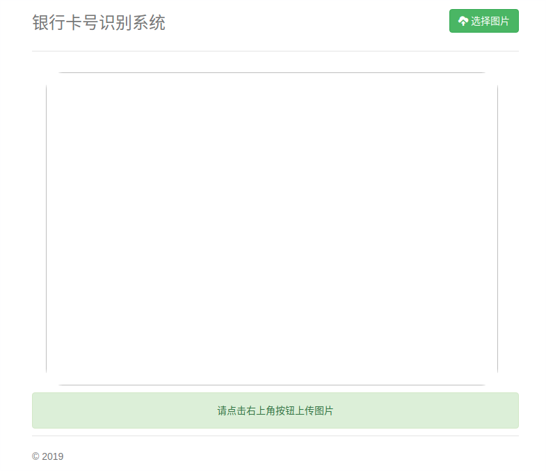

https://github.com/Sierkinhane/crnn_chinese_characters_rec

https://github.com/xiaofengShi/CHINESE-OCR

https://github.com/eragonruan/text-detection-ctpn

https://github.com/chineseocr/chineseocr

## INSTALL

Ubuntu18/16.04 + CUDA 8.0.61 + GeForce GTX 960M + NVIDIA Driver 430.14 + Python3.6 + Tensorflow-gpu


>torchvision==0.2.2.post3 install after torch done
install warpctc-pytorch==0.1 by https://github.com/SeanNaren/warp-ctc

## ctpn

```bash
cd ctpn/utils/bbox
chmod +x make.sh
./make.sh
```

test_image_folder: data/test_images

ctpn_middel_result_folder: data/middle_result

ctpn_result_folder: data/res # number_x.jpg or .jpeg

## crnn

```bash
cd crnn
python handle_images.py
```
handle images floder: data/images/

image<->correct number folder: crnn/to_lmdb/train.txt

handle images result folder: crnn/to_lmdb/train_images

```bash
cd crnn/to_lmdb

python to_lmdb_py3.py # python to_lmdb_py2.py 
```

lmdb folder: crnn/train/lmdb

```bash
cd crnn

python crnn_main.py # train models

```
trainroot folder: crnn/to_lmdb/lmdb

valroot folder: crnn/to_lmdb/lmdb

train models result folder: crnn/expr

change params: crnn/params.py

if you load_state_dict, change crnn/params.py crnn='your pth path'

crnn model path: crnn/trained_models/crnn_Rec_done.pth

images_path: data/res


## web

to run the web

```python
python run.py
```

url: http://127.0.0.1:5000




