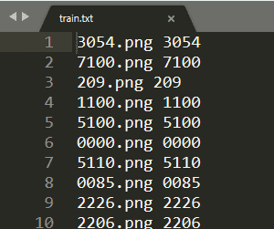

[crnn.pytorch](https://github.com/meijieru/crnn.pytorch)

[text-detection-ctpn](https://github.com/eragonruan/text-detection-ctpn)

[why my accuracy is always 0](https://github.com/meijieru/crnn.pytorch/issues/92)

## INSTALL

Ubuntu18/16.04 + CUDA 8.0.61 + GeForce GTX 960M + NVIDIA Driver 430.14 + Python3.6 + Tensorflow-gpu


- torchvision==0.2.2.post3 install after torch done
- install warpctc-pytorch==0.1 by https://github.com/SeanNaren/warp-ctc

## ctpn

```bash
cd ctpn/utils/bbox
chmod +x make.sh
./make.sh
```

## crnn

```bash
python crnn/handle_images.py
```
handle images floder: data/images/

image, correct number folder: crnn/to_lmdb/train.txt



handle images result folder: crnn/to_lmdb/train_images

```bash
python crnn/to_lmdb/to_lmdb_py3.py # python crnn/to_lmdb/to_lmdb_py2.py 
```

lmdb folder: crnn/train/lmdb

```bash
python crnn/train.py # train crnn models

```
trainroot folder: crnn/to_lmdb/lmdb

valroot folder: crnn/to_lmdb/lmdb

train models result folder: crnn/expr

## change params

>if you change params

- ctpn/params.py
- crnn/params.py

## web

run the web

```python
python run.py
```

ctpn: download the ckpt file from https://github.com/eragonruan/text-detection-ctpn#demo

crnn model path: crnn/trained_models/crnn_Rec_done.pth

http://127.0.0.1:5000

## result

>current crnn params and lmdb niter 60
(complete distinguish one of the test_images, as follows)


